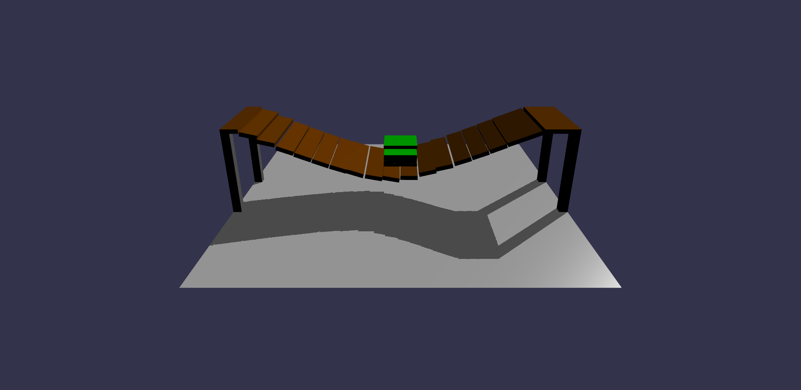

# BabylonPhysicsTutorials
A simple set of tutorials for getting up and running with physics in Babylon.js using Ammo.js physics engine.

Demo Screenshots
================
Here are a few snapshots of the tutorial demos.

## Simple Box
Shows how to add a single rigid body - <a href="https://raw.githack.com/mmmovania/BabylonPhysicsTutorials/master/SimpleBox.html" target="_blank">Live Demo</a> - 
<a href="https://playground.babylonjs.com/#KPZCU8">Babylon.js Playground</a>

## Multiple Boxes
Shows how to add multiple rigid bodies - <a href="https://raw.githack.com/mmmovania/BabylonPhysicsTutorials/master/MultipleBoxes.html" target="_blank">Live Demo</a> - <a href="https://playground.babylonjs.com/#8P4W9T">Babylon.js Playground</a>

## Shooting
Shows how to handle the left mouse click to launch projectile in the viewing direction for shooting balls on the boxes - <a href="https://raw.githack.com/mmmovania/BabylonPhysicsTutorials/master/Shooting.html" target="_blank">Live Demo</a> - <a href="https://playground.babylonjs.com/#VSB2WG">Babylon.js Playground</a>

## Simple Joint
Shows how to add a simple point to point constraint - <a href="https://raw.githack.com/mmmovania/BabylonPhysicsTutorials/master/SimpleJoint.html" target="_blank">Live Demo</a> - <a href="https://playground.babylonjs.com/#BPLMNR">Babylon.js Playground</a>

## Simple Ball
Showing how to create rolling ball physics. This demo shows you how to make a ball roll on the ground using the keyboard keys

### Controls:
Press 'w' to roll ball forward 
Press 's' to roll ball backward 
Press 'a' to roll ball to the left 
Press 'd' to roll ball to the right 

<a href="https://raw.githack.com/mmmovania/BabylonPhysicsTutorials/master/SimpleBall.html" target="_blank">Live Demo</a> - <a href="https://playground.babylonjs.com/#QPFZNY">Babylon.js Playground</a>

## Picking
Shows how to use the left mouse button to pick a rigid body - <a href="https://raw.githack.com/mmmovania/BabylonPhysicsTutorials/master/Picking.html" target="_blank">Live Demo</a> - <a href="https://playground.babylonjs.com/#UASVC5#1">Babylon.js Playground</a>

## Bridge 
Shows how to use the hinge joint to make a bridge - <a href="https://raw.githack.com/mmmovania/BabylonPhysicsTutorials/master/Bridge.html">Live Demo</a> - <a href="https://playground.babylonjs.com/#NNJJ5Z#3">Babylon.js Playground</a>

## Cloth
Shows how to make a cloth softbody - <a href="https://raw.githack.com/mmmovania/BabylonPhysicsTutorials/master/Cloth.html">Live Demo</a> - <a href="https://playground.babylonjs.com/#8IJ09P#10">Babylon.js Playground</a>

## Vehicle
Shows how to make a vehicle 

### Controls:
Press 'w' to accelerate the car forward 
Press 's' to decelerate the car backward 
Press 'a' to turn the car left 
Press 'd' to turn the car right 

<a href="https://raw.githack.com/mmmovania/BabylonPhysicsTutorials/master/Vehicle.html">Live Demo</a> - <a href="https://playground.babylonjs.com/#7IQAPH">Babylon.js Playground</a>

## Tank
Shows how to make a tank using raycast vehicle. This demo is based on the excellent open source project: https://github.com/RuanLucasGD/Simple-Militay-Tank-Physics.
The tank rig is also from the same repo. so a huge shout out to RuanLucasGD. The fbx was converted to gltf using the 3dsmax babylon exporter. 

### Controls:
Press 'w' to accelerate the tank forward 
Press 's' to decelerate the tank backward 
Press 'a' to turn the tank left 
Press 'd' to turn the tank right 
Press 'q' to lower the gun down 
Press 'e' to lift the gun up 
Press 'z' to turn the turret left 
Press 'c' to turn the turret right 

<a href="https://raw.githack.com/mmmovania/BabylonPhysicsTutorials/master/SimpleTank.html">Live Demo</a> - <a href="https://playground.babylonjs.com/#BA06DD#2">Babylon.js Playground</a>

